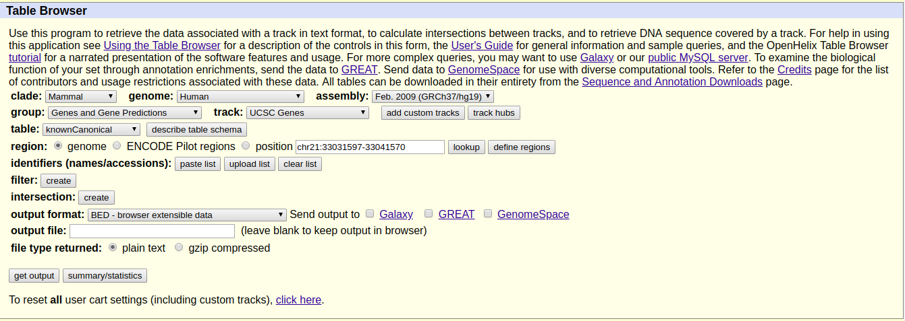
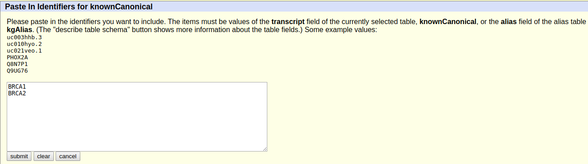
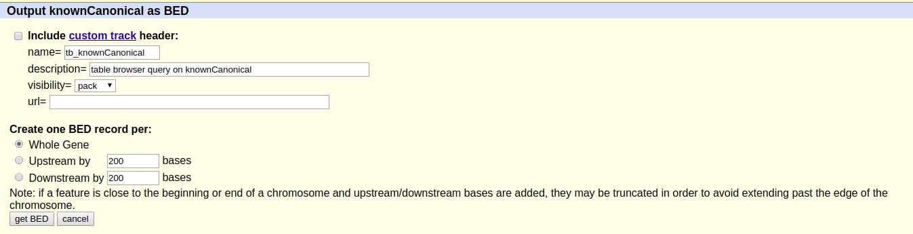

# Como criar um arquivo BED

>Através do *table browser* da UCSC criaremos o arquivo BED com as regiões de interesse para a chamada de variante

## Entre no [site do UCSC *table browser*](https://genome.ucsc.edu/cgi-bin/hgTables)

1. Faça as seguintes mudanças:

> **assembly:** Feb. 2009 (GRCh37/hg19)
> **track:** UCSC Genes
> **table:** knownCanonical
> **output format:** BED - browser extensible data

2. Agora em **indentifiers (names/acessions):** selecione `paste list` e coloque os genes BRCAs um abaixo do outro como:

> BRCA1
> BRCA2

3. Clique em `get output`;
4. Na página do output, selecione `Whole Gene` e selecione `get BED`;

5. Copie o resultado e cole num arquivo `BRCA.bed` ou clique com o botão direito e selecione **salvar como..** (ou **save as..**), só por o nome BRCA.bed e selicionar a pasta de chamada de variante para salvar.
